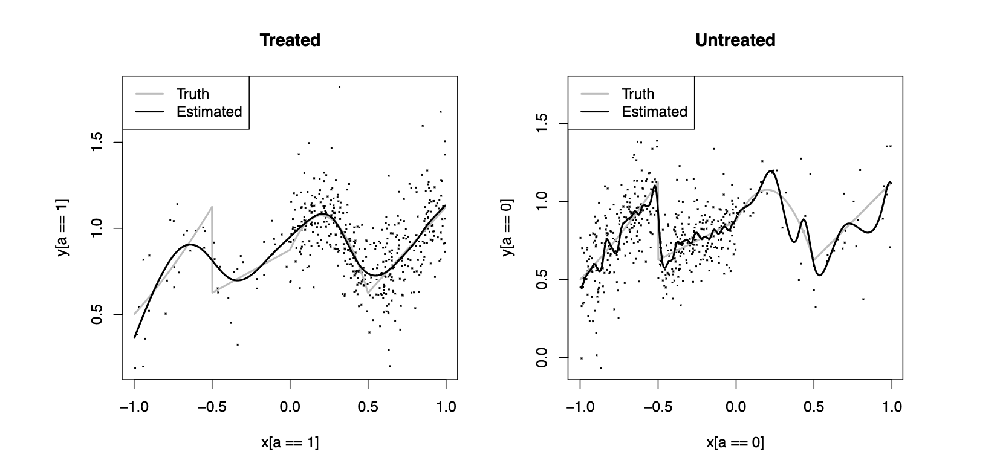

## Learning Goals

By the end of this module, you should be able to:

- Explain why treatment effect heterogeneity matters for precision medicine.
- Distinguish ITE, ATE, and CATE.
- Compare meta-learners such as S-, T-, and X-learners conceptually.
- Fit and interpret parametric and non-parametric models for HTE estimation.

::: notes
Suggested timing: 75 minutes total. Spend about 25 minutes on concepts, 25 minutes on methods, and 25 minutes on code/demo/discussion.
:::

# The Potential Outcomes Framework

## Observed Data
::: {.fragment}
In a randomized or observational study, we can observe:

| Subject | Given treatment? | Outcome |
|---------|------------------|---------|
| 1       | N                | 3.5     |
| 2       | N                | 4       |
| ...     | ...              | ...     |
| $n - 1$ | Y                | 6.5     |
| $n$     | Y                | 4.5     |
:::

::: {.fragment}
::: callout-note
We see **correlation** here... but do we observe **causation**?
:::
:::

## Are These Observations All There Are?
::: {.fragment}
What if, in a parallel universe, each subject receives the *exact opposite treatment* and we observe their outcomes?
:::

::: {.fragment}
+----------+---------------------------+--------------------------------+------------------------+-----------------------------+--------------------------+
| Subject  | Treatment? (Our Universe) | Treatment? (Parallel Universe) | Outcome (Our Universe) | Outcome (Parallel Universe) | Diff. in Outcome (Y - N) |
+==========+===========================+================================+========================+=============================+==========================+
| 1        | N                         | Y                              | 3.5                    | 4.2                         | 0.7                      |
+----------+---------------------------+--------------------------------+------------------------+-----------------------------+--------------------------+
| 2        | N                         | Y                              | 4                      | 4.6                         | 0.6                      |
+----------+---------------------------+--------------------------------+------------------------+-----------------------------+--------------------------+
| ...      | ...                       | ...                            | ...                    |                             | ...                      |
+----------+---------------------------+--------------------------------+------------------------+-----------------------------+--------------------------+
| $n - 1$  | Y                         | N                              | 6.5                    | 5.5                         | 1                        |
+----------+---------------------------+--------------------------------+------------------------+-----------------------------+--------------------------+
| $n$      | Y                         | N                              | 4.5                    | 4                           | 0.5                      |
+----------+---------------------------+--------------------------------+------------------------+-----------------------------+--------------------------+
:::

::: {.fragment}
This table shows *potential* *outcomes*, each following a distribution:

1.  The observable factual outcomes (our universe);

2.  The invisible *counterfactual* outcomes (the parallel universe).
:::

::: {.fragment}
This is also called the **Neyman-Rubin causal model**.
:::

## Are These Observations All There Are (Cont.)?

::: {#fig-evelyn-dialogue layout-ncol=1 fig-align="center"}
{width="45%"}

*Everything Everywhere All at Once*: a masterpiece of counterfactual thinking.
:::

## A Potential Outcome Dataset
::: {.fragment}
This dataset has all the ingredients we need to describe the causal framework. Let us assign them some notations.
:::

::: {.fragment}
For customers who are not given the promotion in our universe (only bold values are observed.):

+--------------+----------+----------------+------------+------------+------------+
| Customer $i$ | $A_i$    | Opposite $A_i$ | $Y^*_i(0)$ | $Y^*_i(1)$ | $\Delta_i$ |
+==============+==========+================+============+============+============+
| 1            | **N**    | Y              | **3.5**    | 4          | 0.7        |
+--------------+----------+----------------+------------+------------+------------+
| 2            | **N**    | Y              | **4**      | 4.5        | 0.6        |
+--------------+----------+----------------+------------+------------+------------+
:::

::: {.fragment}
For those who are given the promotion:

+--------------+----------+----------------+------------+------------+------------+
| Customer $i$ | $A_i$    | Opposite $A_i$ | $Y^*_i(1)$ | $Y^*_i(0)$ | $\Delta_i$ |
+==============+==========+================+============+============+============+
| $n - 1$      | **Y**    | N              | **6.5**    | 6          | 1          |
+--------------+----------+----------------+------------+------------+------------+
| $n$          | **Y**    | N              | **4.5**    | 4          | 0.5        |
+--------------+----------+----------------+------------+------------+------------+

:::

## A Potential Outcome Dataset (Cont.)
::: {.fragment}
Combining both groups — bold entries are the only values observed in reality:

| Customer $i$ | $A_i$ | $Y^*_i(0)$ | $Y^*_i(1)$ | $\Delta_i$ |
|--------------|-------|------------|------------|------------|
| 1            | N     | **3.5**    | 4          | 0.7        |
| 2            | N     | **4**      | 4.5        | 0.6        |
| ...          | ...   | ...        | ...        | ...        |
| $n - 1$      | Y     | 6          | **6.5**    | 1          |
| $n$          | Y     | 4          | **4.5**    | 0.5        |
:::

## Notation
::: {.fragment}
+-----------------------------------+-----------------------------------------------+
| Symbol                            | Meaning                                       |
+===================================+===============================================+
| $Y^*_i(1)$                        | Potential outcome under treatment             |
+-----------------------------------+-----------------------------------------------+
| $Y^*_i(0)$                        | Potential outcome under control               |
+-----------------------------------+-----------------------------------------------+
| $A_i \in \{0,1\}$                 | Observed (binary) treatment                   |
+-----------------------------------+-----------------------------------------------+
| $X_i$                             | Baseline covariates (age, spice tolerance, …) |
+-----------------------------------+-----------------------------------------------+
| $\Delta_i := Y^*_i(1) - Y^*_i(0)$ | Individual treatment effect (ITE)             |
+-----------------------------------+-----------------------------------------------+
:::

::: {.fragment}
::: callout-note
## Notes on Notation

1.  For the sake of presentation, we will limit our attention to binary treatments and continuous outcomes. Multiple extension methods have been derived for other situations.

2.  Other publications might use different notations. For example, @wager2024causal uses $W_i$ for treatment and $Y_i(W_i)$ for potential outcomes.
:::
:::

# Causal Estimands

## Individual Treatment Effect: ITE
::: {.fragment}
If the treatment options are binary, the ITE is

$$ \Delta_i := Y^*_i(1)-Y^*_i(0).$$
:::

::: {.fragment}
The ITE is appealing, but it can never be identified or estimated - we never observe both potential outcomes for the same person.
:::

::: {.fragment}
This is the **fundamental problem of causal inference**.

<!-- {width="30%," fig-align="center"} -->
:::


## Average Treatment Effect: ATE

::: {.fragment}
Instead of ITE, we could identify the ATE under certain assumptions (to be introduced later). The ATE is defined as

$$ \text{ATE} := E[Y^*_i(1)-Y^*_i(0)]. $$
:::

::: {.fragment}
It is a population average effect. An example interpretation is:

*The ATE is the expected difference in outcome if everyone in the target population received the treatment versus if everyone did not receive the treatment.*
:::

::: {.fragment}
::: callout-note
The ATE is a direct causal quantity (estimand), but it hides *who benefits more or less* from the treatment.
:::
:::

## ATE May Not Be Enough
::: {.fragment}
When treatment effects vary across people (i.e. *heterogeneous*), the population average conceals who actually benefits:
:::

::: {.fragment}
- A cancer treatment may work only in biomarker-positive patients.
:::
::: {.fragment}
- Older or pediatric patients may respond differently to a treatment.
:::
::: {.fragment}
- Prior treatment history may have an effect on the response.
:::

::: {.fragment}
::: callout-important
By assuming homogeneous responses to a treatment, we cannot achieve the goals of *precision medicine*, namely tailoring the treatments to patients who benefit the most from them.
:::
:::

## Heterogeneous Treatment Effects
::: {.fragment}
**Heterogeneous treatment effects (HTE)** occur when the causal effect of a treatment varies across individuals or subgroups due to differences in their baseline characteristics.
:::

::: {.fragment}
**Why HTE matters:**

- **Precision medicine** — knowing *who* benefits allows treatment to be targeted.
- **Subgroup effects** — subgroups that show no response may be hidden by a positive ATE.
- **Resource allocation** — directing treatments to likely responders to maximize treatment benefits.
- **Policy and regulation** — subgroup evidence informs approved indications, labels, and contraindications.
:::

## Conditional Average Treatment Effect: CATE - an HTE Estimand
::: {.fragment}
To capture sub-population differences, we introduce CATE:

$$\tau(x):=E[Y^*_i(1)-Y^*_i(0)\mid X_i=x].$$
:::

::: {.fragment}
An example interpretation is:

*The CATE at* $X_i = x$ *is the expected difference in outcome i f everyone with characteristics* $x$ *received the treatment versus if everyone with those characteristics did not.*
:::

::: {.fragment}
::: callout-note
- CATE is identifiable under the same assumptions as ATE and is the central estimand in HTE analysis. Its granularity is determined by the pre-specified covariate set $X$.

- CATE is as close we can get to ITE.
:::
:::

## HTE Questions and Tasks

::: {.fragment}
There are many distinct statistical tasks that could be performed based on different HTE research questions:
:::

::: {.fragment}
+-----------------------------------------------------------------------------+--------------------------------+
| Research Question                                                           | Statistical Task               |
+=============================================================================+================================+
| What is the treatment effect for individuals with characteristics $X = x$?  | CATE estimation                |
+-----------------------------------------------------------------------------+--------------------------------+
| Is the estimated effect for a subgroup statistically significant?           | HTE inference                  |
+-----------------------------------------------------------------------------+--------------------------------+
| Which subgroups benefit more (or less) from the treatment?                  | Subgroup discovery             |
+-----------------------------------------------------------------------------+--------------------------------+
| Which covariates drive treatment effect heterogeneity?                      | Effect modifier identification |
+-----------------------------------------------------------------------------+--------------------------------+
| For whom should treatment be prioritised, given limited resources or risks? | Treatment rule derivation      |
+-----------------------------------------------------------------------------+--------------------------------+
:::
# Estimation of CATE

## Identification Assumptions
::: {.fragment}
Assume $\{Y^*_i(1), Y^*_i(0), A_i, X_i\} \overset{i.i.d.}{\sim} P$ for some distribution $P$. The following assumptions are necessary:
:::

::: {.fragment}
1.  **SUTVA**: the full name is Stable Unit Treatment Value Assumption, which requires *consistency*: observed outcome equals the potential outcome under the received treatment, $Y_i = Y^*_i(A_i)$.

    $$ Y_i = A_iY^*_i(1) + (1-A_i)Y^*_i(0), $$

    and *no interference between units/subjects*.
:::
::: {.fragment}
2.  **Exchangeability / no unmeasured confounding**: no confounders beyond the set of covariates $X$.

    $$ Y^*_i(1), \ Y^*_i(0) \perp A_i \mid X_i.$$

    Conditioning on observed covariates, potential outcomes do not affect treatment assignment.
:::
## Identification Assumptions (Cont.)
::: {.fragment}
3.  **Positivity (overlap)**: every unit has a positive probability of receiving either treatment. Define the propensity score as $e(x) = P(A_i = 1 \mid X_i = x)$, then

    $$ 0 < e(x) < 1 \quad \text{for all } x \in \textrm{supp}(X_i). $$
:::

::: {.fragment}
::: callout-important
In randomized trials, both no unmeasured confounding and positivity assumptions are automatically satisfied.

However, while SUTVA is often assumed, it can be easily violated. In reality, it is very difficult to guarantee zero interference between two units/patients.
:::
:::

## Propensity Score
::: {.fragment}
When $X_i$ is high-dimensional, conditioning on it directly becomes intractable. Instead, we use the *propensity score*:

$$e(X_i) = P(A_i = 1 \mid X_i),$$

which captures how likely a unit is to receive treatment given the covariates.
:::

::: {.fragment}
A key result [@rosenbaum1983central] is that exchangeability conditional on $X_i$ is equivalent to exchangeability conditional on $e(X_i)$:

$$Y^*_i(1), \ Y^*_i(0) \perp A_i \mid e(X_i).$$

Conditioning on the scalar propensity score is therefore sufficient to account for all observed confounders.[^1]
:::

[^1]: A major dimension reduction that underpins inverse-probability weighting and doubly robust estimators.

## Observed vs. Potential Outcomes
::: {.fragment}
How do we get to potential outcomes from observed outcomes? We break down the CATE:

$$\begin{align}
\tau(x) & =E[Y^*_i(1)-Y^*_i(0)\mid X_i=x] \\
        & =E[Y^*_i(1)\mid X_i=x] - E[Y^*_i(0)\mid X_i=x] \\
        & :=\mu_{1}(x) - \mu_0(x).
\end{align}$$
:::

::: {.fragment}
By assuming consistency and exchangeability, we can relate the potential outcomes to observed outcomes. For $\mu_1(x)$:

$$\begin{align}
\mu_1(x) &= E[Y^*_i(1)\mid X_i=x] \\
         &= E[Y^*_i(1)\mid X_i=x, A_i = 1] \quad \text{(exchangeability)} \\
         &= E[Y_i\mid X_i=x, A_i = 1]. \quad \text{(consistency)}
\end{align}$$

And symmetrically, $\mu_0(x) = E[Y_i \mid X_i = x, A_i = 0]$.
:::

## Observed vs. Potential Outcomes (Cont.)
::: {.fragment}
Together, these results allows the identification of CATE — each potential outcome mean equals a conditional mean of observed outcomes:

$$\begin{align}
\mu_1(x) &= E[Y_i\mid X_i=x, A_i = 1] \\
\mu_0(x) &= E[Y_i\mid X_i=x, A_i = 0] \\
\tau(x) &= \mu_{1}(x) - \mu_0(x)
\end{align}$$

This is why CATE is identifiable from data: under our three assumptions.
:::

::: {.fragment}
::: callout-note
Together with the expected observed outcomes $E[Y_i \mid X_i]$ and propensity scores $e(X_i)$, $\mu_1(x)$ and $\mu_0(x)$ are called *nuisance functions* for CATE estimation.
:::
:::

## Pseudo-Outcomes
::: {.fragment}
So far, all of the nuisance functions use $Y_i$ as the outcomes. Under *the no unmeasured confounding* assumption, few other estimators constructed from $Y_i, \ A_i$ and the nuisance functions are also unbiased estimators for CATE:

- $\text{IPW}_i = \frac{A_iY_i}{e(X_i)} - \frac{( 1 - A_i)Y_i}{1 - e(X_i)}.$

- $\text{AIPW}_i = \mu_1(X_i) - \mu_0(X_i) + \frac{A_i \{Y_i - \mu_1(X_i)\}}{e(X_i)} - \frac{( 1 - A_i)\{Y_i - \mu_0(X_i)\}}{1 - e(X_i)}.$
:::

::: {.fragment}
Both IPW and AIPW estimators arise from ATE estimation and satisfy

$$E[\text{IPW}_i | X_i] = E[\text{AIPW}_i | X_i] = \tau(X_i).$$

They are sometimes called **pseudo-outcomes** and allow us to plug in estimation for $e(X_i)$, $\mu_1(X_i)$, and $\mu_0(X_i)$ to estimate CATE [@nie2021quasioracle; @kennedy2023].
:::

## CATE Estimation Methods
::: {.fragment}
1.  **Domain-knowledge methods**:

    - Regression models with interactions
:::

::: {.fragment}
2.  **Data-driven methods**:

    - Meta-learners: breaking down CATE into *nuisance functions* and estimating each using non-parametric/ML models

      - S-learner, T-learner, X-learner, R-learner, and DR-learner
    
    - Causal ML: tweaking the objective functions of ML models to estimate CATE

      - Causal trees, causal forests, causal boosting, Bayesian causal forests
:::

::: {.fragment}
::: callout-tip
Choosing the appropriate methods depends on the HTE tasks one has in mind based on the research questions. No HTE methods are the outright the "most appropriate".
:::
:::

# Domain-Knowledge Methods

## Regression with Interaction Terms
::: {.fragment}
We can use a single regression model to estimate both $\mu_1(x)$ and $\mu_0(x)$ by adding **interaction terms** between treatment $A_i$ and covariates $X_i$:

$$\mu_{a}(x) = E[Y_i \mid X_i = x, A_i = a] = \alpha + \beta a + \gamma^\top x + \delta^\top (a \cdot x)$$
:::

::: {.fragment}
The coefficients $\delta$ capture how each covariate modifies the treatment effect. The CATE for a profile $X_i = x$ can be estimated directly:

$$\hat{\tau}(x) = \hat{\mu}_1(x) - \hat{\mu}_0(x) = \hat{\beta} + \hat{\delta}^\top x.$$
:::

::: {.fragment}
The regression model is interpretable, but constrains CATE to be linear in $X_i$, while all effect modifiers must be pre-specified.
:::

::: {.fragment}
::: callout-note
This is a **linear parametric instance of the S-learner** introduced in the next section. Replacing the linear model with a random forest or gradient booster gives the full S-learner, which can capture nonlinear CATE without pre-specifying interactions.
:::
:::
# Meta-Learners

## Meta-Learners: The Core Idea
::: {.fragment}
A meta-learner breaks down CATE into a few *nuisance functions*, which could be estimated separately. It is a strategy for converting CATE estimation into standard prediction problems.
:::

::: {.fragment}
Common examples covered here:

- S-learner
- T-learner
- X-learner
:::

::: {.fragment}
Notable others (not covered today): R-learner [@nie2021quasioracle] and doubly robust (DR) learner [@kennedy2023].
:::

::: {.fragment}
::: callout-note
Meta-learners' validity hinges on the three assumptions for CATE estimation: SUTVA, no unobserved confounding, and positivity/overlap.
:::
:::
## S-Learner
::: {.fragment}
The most straightforward estimator of CATE. Also called a *single* learner. Fit *one* model for the outcome

$$ \mu_a(x) = E[Y_i\mid X_i=x,A_i=a], $$

by including $x$ and $a$ as covariates. 
:::

::: {.fragment}
Then estimate CATE via

$$\hat{\tau}(x) = \hat{\mu}_1(x) - \hat{\mu}_0(x).$$

Here, $\mu_a(x)$ can be estimated by any valid model, for example, a regression model, a decision tree, or a random forest, as long as treatment is included as a covariate.
:::

::: {.fragment}
::: callout-note
Recall that the regression model we showcased was a special case of the S-learner, where

$$\mu_{a}(x) = \alpha + \beta a + \gamma^\top x + \delta^\top (a \cdot x).$$
:::
:::
## T-Learner
::: {.fragment}
Instead of fitting a single model for $\mu_a(x)$, T-learner fits *two* separate outcome models:

$$\mu_1(x) = E[Y_i\mid X_i=x,A_i=1],$$ and

$$\mu_0(x) = E[Y_i\mid X_i=x,A_i=0].$$
:::

::: {.fragment}
Then estimate CATE

$$\hat{\tau}(x) = \hat{\mu}_1(x) - \hat{\mu}_0(x).$$
:::

::: {.fragment}
T-learner is equal to fitting two separate models on the two treatment subgroups. It offers more flexibility in the modeling of CATE. However, it suffers from high variability when the groups are imbalanced.
:::
## T-Learner (Cont.)

::: {#fig-t-learns layout-ncol=1}
{width="70%," fig-align="center"}

The limitations of T-learners. Credits to @kennedy2023.
:::

## X-Learner
::: {.fragment}
The X-learner [@kunzel2019metalearners] improves on the T-learner when arms are imbalanced. The algorithm is:

::: callout-note
## The X-Learner

**Step 1 —** Fit T-learner outcome models $\hat{\mu}_1(x)$ and $\hat{\mu}_0(x)$ separately on each arm. Fit an independent propensity score model $\hat{e}(x)$.

**Step 2 — Impute individual effects**:

$$D_i^{(1)} = Y_i - \hat{\mu}_0(X_i) \quad \text{(treated)}, \qquad D_i^{(0)} = \hat{\mu}_1(X_i) - Y_i \quad \text{(control)}.$$

**Step 3 — Model the imputed effects**: fit $\hat{\tau}_1(x)$ on $\{(X_i, D_i^{(1)})\}$ for treated units and $\hat{\tau}_0(x)$ on $\{(X_i, D_i^{(0)})\}$ for control units.

**Step 4 — Combine via propensity score**:

$$\hat{\tau}(x) = \hat{e}(x)\,\hat{\tau}_0(x) + \bigl(1 - \hat{e}(x)\bigr)\,\hat{\tau}_1(x).$$
:::
:::

## X-Learner Intuition
::: {.fragment}
Basic idea:

1.  Fit separate outcome models.
2.  Impute treatment effects for treated and control units.
3.  Fit models for those imputed effects.
4.  Combine them using propensity scores.
:::

::: {.fragment}
::: callout-note
The X-learner is useful when treatment groups are imbalanced, especially when one group is much larger than the other [@kunzel2019metalearners] due to the two-stage cross-over estimation of CATE.
:::
:::
## Meta-Learner Comparison
::: {.fragment}
+--------------+---------------------------------+--------------------------------+-------------------------------------------------+
| Learner      | Main idea                       | Strength                       | Risk                                            |
+==============+=================================+================================+=================================================+
| S-learner    | One model includes treatment    | Stable and simple              | May shrink treatment effect heterogeneity       |
+--------------+---------------------------------+--------------------------------+-------------------------------------------------+
| T-learner    | Separate treated/control models | Flexible heterogeneity         | Can be noisy with small groups                  |
+--------------+---------------------------------+--------------------------------+-------------------------------------------------+
| X-learner    | Impute effects, then model them | Efficient with imbalanced arms | More complex; propensity estimation adds a step |
+--------------+---------------------------------+--------------------------------+-------------------------------------------------+
:::

::: {.fragment}
::: callout-note
## Additional Notes on Meta-Learners

1.  No single meta-learner holds a universal advantage over other learners. The best meta-learner is determined case by case.

2.  Meta-learners are plug-in estimators of CATE. They do not directly estimate CATE. Inferences based on meta-learners should be carefully thought out.
:::
:::

# Causal ML

## Causal Trees
::: {.fragment}
- Modifiy the standard CART splitting criterion to target treatment effect heterogeneity rather than outcome prediction [@athey2016recursive].
:::

::: {.fragment}
- A causal tree maximizes **the difference in treatment-effect estimates between the two leafs**, while keeping a mix of treated and untreated units in each leaf for fair comparison.
:::

::: {.fragment}
- Each leaf then contains units with similar estimated $\tau(X_i)$.
:::

::: {.fragment}
::: callout-important
- A causal tree is a direct non-parametric estimator of CATE.
:::
:::

## Honest Causal Trees
::: {.fragment}
**Honest causal trees** separates the sample:

- A *structure subsample* — used to select splits, implement cross-validation, and perform pruning;

- An *estimation subsample* — used to compute within-leaf treatment-effect estimates.
:::

::: {.fragment}
This prevents the tree from inflating its own leaf-level estimates and is what allows causal trees to produce asymptotically valid confidence intervals [@athey2016recursive].
:::

::: {.fragment}
::: callout-note
Honest causal trees are the default trees used by causal forests.
:::
:::

## Causal Forests
::: {.fragment}
A single causal tree has high variance. Causal forests [@wager2018estimation] average many causal trees using bagging to directly estimate $\tau(x)$ . It enjoys several properties:

- **Nonparametric**
- **Treatment-effect splits**
- **Honest**
- **Asymptotically normal**:
  - Pointwise standard errors follow from the infinitesimal jackknife; the `grf` package computes these automatically.
:::

::: {.fragment}
::: callout-note
The asymptotic normality allows inference (e.g., 95% CI) on CATE.
:::
:::

# An Example CATE Analysis

## A Simulated Example

::: {.fragment}
A Korean BBQ restaurant is testing a new promotion: **free corn cheese with the meal.**
:::

::: {.fragment}
::::: columns
::: {.column width="60%"}
- **Outcome:** post-meal satisfaction (continuous).

- **Treatment:** whether the diner was offered the promotion (binary).

- **Questions:**

  1.  Did the promotion work equally well for everyone? If so, by how much for each segment of customers?

  2.  Can we use this promotion by targeting certain customers?
:::

::: {.column width="30%"}
{width="90%"}
:::
:::::
:::

::: {.fragment}
::: callout-tip
- Can the experiment be randomized?

- Think about which HTE tasks these questions are tied to. What do we need to do?
:::
:::
## A Simulated Korean BBQ Dataset
::: {.fragment}
A high-level summary of the dataset:

- Generate a sample of $n = 1{,}000$ diners with realistic covariate distributions.
- The promotion is assigned **observationally** — not randomized.
- We record the true CATE for each diner, which we would never observe in real data.
- This lets us directly measure how accurately each method recovers $\tau(X_i)$.
:::

::: {.fragment}
::: callout-note
## Translation of Problems

The Korean BBQ setting translates cleanly to a observational study in clinical settings.
:::
:::

## Data Generating Process
::: {.fragment}
We simulate $n = 1{,}000$ diners in an **observational** setting:

+------------------+-----------------------------------------------------------------------------------------------------------------------------------------------------------------------------------+
|                  |                                                                                                                                                                                   |
+==================+===================================================================================================================================================================================+
| **Component**    | **Specification**                                                                                                                                                                 |
+------------------+-----------------------------------------------------------------------------------------------------------------------------------------------------------------------------------+
| Covariates       | `age` $\sim$ Normal(38, 12²); `spice_tolerance` $\sim$ Bernoulli(0.55);                                                                                                           |
|                  |                                                                                                                                                                                   |
|                  | `visit_frequency` $\sim$ Poisson(3); `party_size` $\sim$ Uniform{1,…,6}                                                                                                           |
+------------------+-----------------------------------------------------------------------------------------------------------------------------------------------------------------------------------+
| Propensity score | $\begin{aligned}e(X_i) &= \text{logit}^{-1}(-1 + 0.02\,\text{age} \\ &+ 0.25\,\text{visit frequency} - 0.10\,\text{party size})\end{aligned}$                                     |
+------------------+-----------------------------------------------------------------------------------------------------------------------------------------------------------------------------------+
| Baseline outcome | $\begin{aligned} \mu_0(X_i) &= 5.5 + 0.02\,\text{age} \\&+ 0.20\,\text{visit frequency} + 0.15\,\text{party size} \end{aligned}$                                                  |
+------------------+-----------------------------------------------------------------------------------------------------------------------------------------------------------------------------------+
| True CATE        | $\begin{aligned}\tau(X_i) &= 0.4 \\ &+ 1.0\cdot\mathbf{1}[\text{spice tolerance}=0]\cdot\mathbf{1}[\text{visit frequency}>2] \\ &- 0.01\cdot\max(\text{age}-40,\,0)\end{aligned}$ |
+------------------+-----------------------------------------------------------------------------------------------------------------------------------------------------------------------------------+
| Observed outcome | $Y_i = \mu_0(X_i) + \tau(X_i)\,A_i + \varepsilon_i,\quad \varepsilon_i \sim N(0,1)$                                                                                               |
+------------------+-----------------------------------------------------------------------------------------------------------------------------------------------------------------------------------+

::: notes
Notice that `promotion` is not randomized — diners who visit more often are more likely to receive it, creating confounding between `visit_frequency` and the outcome. Also notice that we made the true CATE non-linear.
:::
:::

## Data Generating Process (Code)

```{r}
pacman::p_load(dplyr, magrittr, ggplot2, ranger, grf)

set.seed(2026)

n <- 1000
age <- round(rnorm(n, mean = 38, sd = 12))
spice_tolerance <- rbinom(n, 1, 0.55)
visit_frequency <- rpois(n, lambda = 3)
party_size <- sample(1:6, n, replace = TRUE)

## propensity to receive the cheese corn promotion
propensity <- plogis(-1 + 0.02 * age + 0.25 * visit_frequency - 0.10 * party_size)
promotion <- rbinom(n, 1, propensity)

## true heterogeneous treatment effect
true_tau <- 0.4 + 1.0 * (1 - spice_tolerance) * (visit_frequency > 2) - 0.01 * pmax(age - 40, 0)

## baseline satisfaction under no promotion
mu0 <- 5.5 + 0.02 * age + 0.20 * visit_frequency + 0.15 * party_size

satisfaction <- mu0 + true_tau * promotion + rnorm(n, sd = 1) # true CATE model

bbq <- tibble(satisfaction, promotion, age, spice_tolerance, visit_frequency, party_size, true_tau)
```

## A Peek at the Simulated Data
::: {.fragment}
```{r}
knitr::kable(
  head(bbq),
  digits = 3,
  col.names = c("Satisfaction", "Promotion", "Age", "Spice tol.", "Visit freq.", "Party size", "True CATE")
)
```
:::

::: {.fragment}
::: callout-tip
`true_tau` is the ground-truth CATE we would never observe in real data — it is included here solely to evaluate how accurately each method recovers it.
:::
:::

## Clinical Translation
::: {.fragment}
The same principle applies directly to clinical trials and observational studies.

+-----------------------+----------------------------------------------------+
| Korean BBQ            | Clinical / Precision Medicine                      |
+=======================+====================================================+
| Diner                 | Patient                                            |
+-----------------------+----------------------------------------------------+
| Corn cheese promotion | Treatment or intervention                          |
+-----------------------+----------------------------------------------------+
| Satisfaction score    | Clinical endpoint (response, survival, QoL)        |
+-----------------------+----------------------------------------------------+
| Spice tolerance       | Biomarker or genetic subgroup                      |
+-----------------------+----------------------------------------------------+
| Visit frequency       | Baseline disease burden or prior treatment history |
+-----------------------+----------------------------------------------------+
| $\hat{\tau}(x) > 0$   | Predicted responder                                |
+-----------------------+----------------------------------------------------+
:::

::: {.fragment}
Identifying who benefits — and by how much — is the core challenge of precision medicine.
:::

## Regression-Based Model for CATE

```{r}
#| output-location: slide

## fit the linear model
hte_fit <- lm(satisfaction ~ promotion * spice_tolerance +
                promotion * visit_frequency +
                promotion * age +
                promotion * party_size,
              data = bbq)
lin_sum <- summary(hte_fit)$coef %>%
    as_tibble(rownames = "Var")

## summarize the coefficients
knitr::kable(
  head(lin_sum, 10),
  digits = 3,
  col.names = c("variable", "estimate", "std. error", "t-value", "p-value")
)
    
```

::: callout-note
Interaction terms between `promotion` and each covariate allow the treatment effect to vary with patient characteristics. The model-implied CATE for a diner with profile $x$ is the promotion main effect plus all promotion-by-covariate interactions evaluated at $x$.
:::

## Predict CATE from the Regression Model

We copy the dataset twice, set `promotion = 1` in one copy and `promotion = 0` in the other, then predict and subtract. This method is the standard recipe for converting a fitted model into individual CATE estimates.

```{r}
## fix the promotion in each subset
bbq_treat <- bbq_control <- bbq
bbq_treat$promotion <- 1
bbq_control$promotion <- 0

## predict CATE for each subject by plugging in the linear model
bbq$tau_hat_regression <-
  predict(hte_fit, newdata = bbq_treat) -
  predict(hte_fit, newdata = bbq_control)

## see the CATE estimate for the first few subject
head(round(bbq$tau_hat_regression, 3))
```

## Visualize Estimated CATE

We plot estimated CATE against true CATE for all simulated participants. The closer to the diagonal, the better the prediction is:

```{r}
#| output-location: slide

lim_reg <- range(c(bbq$true_tau, bbq$tau_hat_regression))

ggplot(bbq, aes(x = true_tau, y = tau_hat_regression)) +
  geom_point(alpha = 0.25) +
  geom_abline(slope = 1, intercept = 0, linetype = 2, color = "navy") +
  scale_x_continuous(limits = lim_reg) +
  scale_y_continuous(limits = lim_reg) +
  coord_fixed() +
  labs(
    x = "True CATE in simulation",
    y = "Estimated CATE from regression",
    title = "Regression-based CATE estimates"
  ) +
  theme_minimal()
```

## Strengths and Limits

::::: columns
::: {.fragment}
::: {.column width="50%"}
**Strengths**

- Results are directly interpretable: each interaction coefficient has a clear meaning.
- Easy to communicate to clinical collaborators and regulators.
- Well-suited to **pre-specified** subgroup analyses, where the interactions of interest are defined before seeing the data.
:::

::: {.column width="50%"}
**Limitations**

- Interactions must be chosen in advance — unknown or complex effect modifiers are easily missed.
- Assumes a linear relationship between covariates and the treatment effect; **nonlinear heterogeneity** (e.g., thresholds, interactions between modifiers) will be misspecified.
- Coefficient estimates become unstable when many interactions are included relative to sample size.
- Running many interaction tests without correction inflates the false-positive rate.
:::
:::
:::::

## Are the Covariates Balanced?
::: {.fragment}
Before we head into meta-learners, we want to know whether the distribution of covariates are balanced across customers who received and who did not receive the promotion. 
:::

::: {.fragment}
A common technique is using the standardized mean difference (SMD):

$$\text{SMD} = \frac{\bar{x}_1 - \bar{x}_0}{\sqrt{(s_1^2 + s_0^2)/2}}.$$

where $\bar{x}_a$ is the sample mean and $s_a^2$ the sample variance for group $a \in \{0, 1\}$.
:::

## Are the Covariates Balanced? (Cont.)

```{r}
#| output-location: slide

## use the smd package
pacman::p_load(smd)

covs <- c("age", "spice_tolerance", "visit_frequency", "party_size")

## calculate and combine the smd by promotion group
smd_df <- do.call(rbind, lapply(covs, function(v) {
  tibble(
    variable = v,
    smd = smd(bbq[[v]], as.factor(bbq$promotion))$estimate
  )
}))

## plot the smd for each variable
ggplot(smd_df, aes(x = smd, y = reorder(variable, abs(smd)))) +
  geom_point(size = 3) +
  geom_vline(xintercept = 0, colour = "grey40") +
  geom_vline(xintercept = c(-0.1, 0.1), linetype = "dashed", colour = "red") +
  labs(
    x = "Standardised mean difference",
    y = "Variables",
    title = "Covariate Balance: Treated vs. Control",
    caption = "Propensity score logit model: −1 + 0.02·age + 0.25·visit_frequency − 0.10·party_size"
  ) +
  theme_minimal()
```

## S-Learner - A Code Example

- A single random forest is trained on all diners with `promotion` included as an ordinary covariate.

::: callout-note
Because the forest treats treatment like any other variable, it may shrink the treatment signal when covariates are more predictive than treatment status.
:::

```{r}
pacman::p_load(ranger)

## for the S-learner: fit a single random forest model with promotion as a covariate
s_fit <- ranger(
  satisfaction ~ promotion + age + spice_tolerance + visit_frequency + party_size,
  data = bbq,
  num.trees = 500
)
```

## S-Learner - A Code Example (Cont.)

- CATE is extracted by predicting each diner's outcome twice — once with `promotion = 1` and once with `promotion = 0` — and taking the difference.

```{r}
## to estimate CATE, replicate the dataset into two and assign fixed promotion to each
bbq1 <- bbq0 <- bbq 
bbq1$promotion <- 1
bbq0$promotion <- 0

## estimate CATE using the difference of conditional means
pred1_s <- predict(s_fit, data = bbq1)$predictions
pred0_s <- predict(s_fit, data = bbq0)$predictions
bbq$tau_hat_s <- pred1_s - pred0_s
```

## T-Learner - A Code Example

Two separate random forests learn the outcome surface for treated and control diners independently.

```{r}
## fit a model for the subgroup with promotion
t_fit_1 <- ranger(
  satisfaction ~ age + spice_tolerance + visit_frequency + party_size,
  data = subset(bbq, promotion == 1),
  num.trees = 500
)

## fit a model for the subgroup without promotion
t_fit_0 <- ranger(
  satisfaction ~ age + spice_tolerance + visit_frequency + party_size,
  data = subset(bbq, promotion == 0),
  num.trees = 500
)
```

## T-Learner - A Code Example (Cont.)

Predictions for every diner are then made using the full covariate matrix `X_new`, and CATE is the gap between the two predicted surfaces.

::: callout-note
T-learner is more flexible than the S-learner but can be noisier when one group is small.
:::

```{r}
## select the covariates for estimating conditonal means by subgroup
X_new <- bbq[, c("age", "spice_tolerance", "visit_frequency", "party_size")]

## estimate CATE
bbq$tau_hat_t <-
  predict(t_fit_1, data = X_new)$predictions -
  predict(t_fit_0, data = X_new)$predictions
```

## X-Learner — A Code Example

Steps 1–2 use the T-learner outcome models to impute each diner's individual treatment effect, filling in the missing counterfactual.

```{r}
X_all <- bbq[, c("age", "spice_tolerance", "visit_frequency", "party_size")]

## Step 1: fit separate outcome models (same as T-learner)
mu1_fit <- ranger(satisfaction ~ age + spice_tolerance + visit_frequency + party_size,
                  data = subset(bbq, promotion == 1), num.trees = 500)
mu0_fit <- ranger(satisfaction ~ age + spice_tolerance + visit_frequency + party_size,
                  data = subset(bbq, promotion == 0), num.trees = 500)

## Step 2: impute individual treatment effects
mu1_all <- predict(mu1_fit, data = X_all)$predictions
mu0_all <- predict(mu0_fit, data = X_all)$predictions

D1 <- bbq$satisfaction[bbq$promotion == 1] - mu0_all[bbq$promotion == 1]
D0 <- mu1_all[bbq$promotion == 0] - bbq$satisfaction[bbq$promotion == 0]
```

## X-Learner — A Code Example (Cont.)

Steps 3–4 model those imputed effects and blend the two forests using the propensity score.

```{r}
## Step 3: fit models on imputed effects
tau1_fit <- ranger(D1 ~ ., data = cbind(subset(X_all, bbq$promotion == 1), D1),
                   num.trees = 500)
tau0_fit <- ranger(D0 ~ ., data = cbind(subset(X_all, bbq$promotion == 0), D0),
                   num.trees = 500)

## Step 4: combine with propensity score weights
e_hat <- predict(glm(promotion ~ age + spice_tolerance + visit_frequency + party_size, 
                     data = bbq, family = binomial), type = "response")

tau1_pred <- predict(tau1_fit, data = X_all)$predictions
tau0_pred <- predict(tau0_fit, data = X_all)$predictions

bbq$tau_hat_x <- e_hat * tau0_pred + (1 - e_hat) * tau1_pred
```

## Fit a Causal Forest Using `grf`
::: {.fragment}
The `causal_forest` function jointly estimates propensity scores and outcome models via internal cross-fitting, then grows trees that directly target the treatment effect contrast. Unlike meta-learners, it does not require a separate propensity estimation step. Setting `seed` ensures reproducibility across runs.

```{r}
pacman::p_load(grf)

X <- as.matrix(bbq[, c("age", "spice_tolerance", "visit_frequency", "party_size")])
Y <- bbq$satisfaction
A <- bbq$promotion

cf <- causal_forest(X, Y, A, num.trees = 1000, seed = 2026)

bbq$tau_hat_cf <- predict(cf)$predictions

# Doubly robust ATE estimate with standard error
average_treatment_effect(cf)
```
:::

::: {.fragment}
`predict(cf)` returns individual CATE estimates. `average_treatment_effect(cf)` uses a doubly robust augmented estimator — more reliable than averaging the individual CATEs.
:::

## Comparing CATE Estimators

Each panel shows estimated versus true CATE; the dashed diagonal line marks perfect recovery.

```{r}
#| output-location: slide
pacman::p_load(tidyr)

bbq_long <- pivot_longer(
  bbq,
  cols = c(tau_hat_regression, tau_hat_s, tau_hat_t, tau_hat_x, tau_hat_cf),
  names_to = "method",
  values_to = "tau_hat"
)
bbq_long$method <- factor(bbq_long$method,
  levels = c("tau_hat_regression", "tau_hat_s", "tau_hat_t", "tau_hat_x", "tau_hat_cf"),
  labels = c("Regression", "S-learner", "T-learner", "X-learner", "Causal forest")
)

lim_all <- range(c(bbq_long$true_tau, bbq_long$tau_hat))

ggplot(bbq_long, aes(x = true_tau, y = tau_hat)) +
  geom_point(alpha = 0.15) +
  geom_abline(slope = 1, intercept = 0, linetype = 2, color = "navy") +
  scale_x_continuous(limits = lim_all) +
  scale_y_continuous(limits = lim_all) +
  coord_fixed() +
  facet_wrap(~method, nrow = 2) +
  labs(x = "True CATE", y = "Estimated CATE", title = "CATE estimates across methods") + 
  theme_minimal()
```

## Confidence Intervals from Causal Forests
::: {.fragment}
- `grf` provides pointwise standard errors. Setting `estimate.variance = TRUE` triggers an infinitesimal jackknife calculation that returns a per-unit variance estimate alongside each CATE prediction.

- Sparser regions of covariate space and smaller forests produce wider intervals.
:::

::: {.fragment}
```{r}
## retrieve the variance estimation for standard errors
cf_pred <- predict(cf, estimate.variance = TRUE)
bbq$tau_hat_cf_se <- sqrt(cf_pred$variance.estimates)

## 95% confidence interval bounds
bbq$tau_cf_lower <- bbq$tau_hat_cf - 1.96 * bbq$tau_hat_cf_se
bbq$tau_cf_upper <- bbq$tau_hat_cf + 1.96 * bbq$tau_hat_cf_se
```
:::
## Confidence Intervals from Causal Forests (Cont.)

We can draw the 95% CI from causal forests for a random sample of 100 participants and order them according the point CATE estimates.

```{r}
#| output-location: slide
set.seed(42)
bbq_uq <- bbq[sample(nrow(bbq), 100), ]
bbq_uq <- bbq_uq[order(bbq_uq$tau_hat_cf), ]
bbq_uq$rank <- seq_len(nrow(bbq_uq))
bbq_uq$ci_group <- ifelse(bbq_uq$tau_cf_lower > 0, "Positive",
                   ifelse(bbq_uq$tau_cf_upper < 0, "Negative", "Uncertain"))

ggplot(bbq_uq, aes(x = rank, y = tau_hat_cf, colour = ci_group)) +
  geom_hline(yintercept = 0, linetype = "dashed", colour = "grey50") +
  geom_errorbar(aes(ymin = tau_cf_lower, ymax = tau_cf_upper),
                width = 0, alpha = 0.6, linewidth = 0.4) +
  geom_point(size = 1.5) +
  scale_colour_manual(
    values = c("Positive" = "#2c7bb6", "Negative" = "#d7191c", "Uncertain" = "grey60"),
    name = "95% CI"
  ) +
  labs(
    x = "Diner (sorted by estimated CATE)",
    y = expression(hat(tau)(x)),
    title = "Pointwise CATE estimates with 95% confidence intervals",
    subtitle = "100 sampled diners — causal forest, sorted by estimated effect") +
  theme_minimal() +
  theme(legend.position = "bottom")
```

## Explore Who Benefits Most
::: {.fragment}
Diners are split into benefit quartiles based on their causal forest CATE estimates, then average covariate profiles are compared across groups.

```{r}
bbq$benefit_group <- cut(
  bbq$tau_hat_cf,
  breaks = quantile(bbq$tau_hat_cf, probs = c(0, 0.25, 0.75, 1)),
  include.lowest = TRUE,
  labels = c("Lowest estimated benefit", "Middle", "Highest estimated benefit")
)

aggregate(
  cbind(age, spice_tolerance, visit_frequency, party_size) ~ benefit_group,
  data = bbq,
  FUN = mean
) %>% knitr::kable(digits = 3)
```
:::

::: {.fragment}
::: callout-note
In our simulation setup, the group that benefits the most includes younger customers who visit more frequently and has no spice tolerance.
:::
:::

## Targeting Customers
::: {.fragment}
A naive targeting rule for the promotion is:

::: callout-note
## Naive Targeting Rule

Offer the promotion if $\hat{\tau}(x) > 0$.
:::
:::

::: {.fragment}
If budgeting is a concern, a more conservative rule uses the lower confidence bound:

::: callout-note
## A More Conservative Targeting Rule

Offer only if $\hat{\tau}(x) - 1.96 \cdot \widehat{\text{SE}}(x) > 0$.
:::
:::

::: {.fragment}
A thresholding of CATE provides an intuitive rule for applying any treatment or intervention, but is it optimal? 

This motivates our next chapters on ITR: how should we tailor a treatment (promotion) to a population (of patients/customers).
:::

::: notes
Emphasize this is a teaching example. In clinical applications, treatment recommendations require safety, ethics, validation, and clinical judgment.
:::

## Practical Cautions
::: {.fragment}
HTE estimation is powerful but requires careful handling.
:::

::: {.fragment}
- **Poor overlap** — some covariate combinations are rare.
- **Unmeasured confounding** — violate assumptions.
- **Noisy subgroup discovery** — overfutting.
- **Lack of external validation** — CATE models untested.
- **Prediction vs. identification tension** — predictive model, biased CATE estimate.
:::

::: {.fragment}
::: callout-tip
## HTE Analysis Checklist

For a comprehensive checklist of planning and reporting considerations for HTE and subgroup analyses — covering pre-specification, confounding adjustment, multiple testing, and interaction reporting — see @varadhan2013hte.
:::
:::

## Take-Home Messages

::: {.fragment}
- Specify HTE tasks based on research questions.
:::
::: {.fragment}
- CATE describes HTE.
:::
::: {.fragment}
- Causal assumptions are required for CATE identification.
:::
::: {.fragment}
- Domain-knowledge based CATE estimation requires pre-defined covariates and interactions.
:::
::: {.fragment}
- Meta-learners are frameworks that turn models for prediction into CATE estimation tools.
:::
::: {.fragment}
- Causal forests offer flexible HTE estimation with inference.
:::
::: {.fragment}
- HTE motivates ITR.
:::

## Recommended Sources

- Wager (2024), textbook on causal inference and statistical learning [@wager2024causal]
- Athey and Imbens (2016), causal trees and honest estimation [@athey2016recursive]
- Wager and Athey (2018), causal forests [@wager2018estimation]
- Künzel et al. (2019), meta-learners and X-learner [@kunzel2019metalearners]
- Nie and Wager (2021), R-learner [@nie2021quasioracle]
- Kennedy (2023), doubly robust HTE estimation [@kennedy2023]
- `grf` package documentation [@grf]
- Rosenbaum and Rubin (1983), propensity score theory [@rosenbaum1983central]

## References {.allowframebreaks}

::: {#refs}
:::